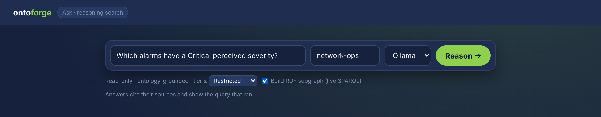
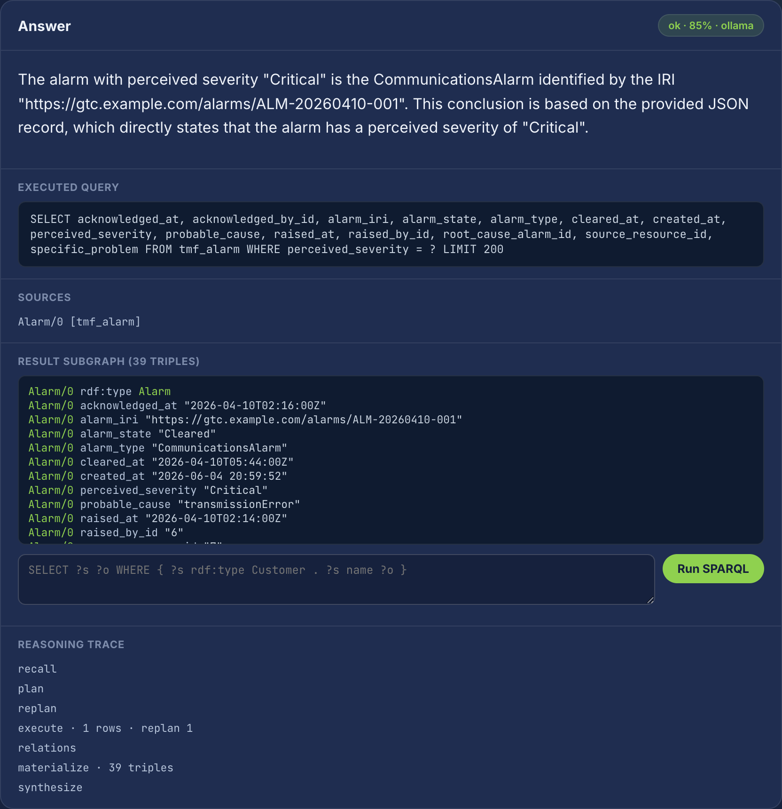
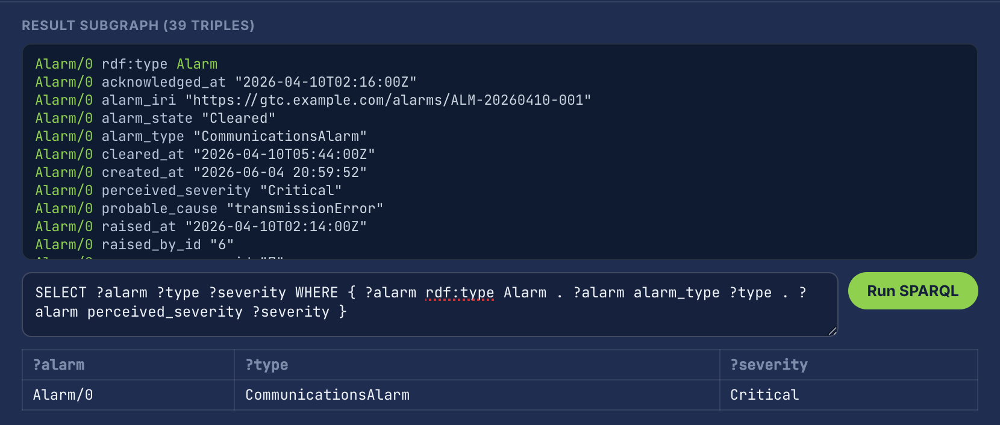

# Ontoforge

**The ontology mesh for GraphRAG.** Mine ontologies from your logs, validate with SHACL, ship a hybrid retriever — without hand-crafting a single Turtle file.

[:material-rocket-launch: Get started](getting-started/index.md){ .md-button .md-button--primary }
[:material-package-variant: Install from PyPI](getting-started/install.md){ .md-button }

---


*The guided wizard (Twilight theme) — Define → Enrich → Build → After. Also ships Mono and Light themes.*

---

## A guided tour

From landing page to ontology-grounded **reasoning search**, in order.

**1. Landing** — the marketing entry point.


**2. Model your domain** — the Twilight wizard walks you from a domain to a
generated ontology in four phases (Define → Enrich → Build → After).


**3. Run report** — every run emits a branded HTML report: competency-question
results, governance scorecard, semantic-loss analysis, and orphan-class checks.


**4. Ask — pose a question** — the read-only, ontology-grounded **Ask** console.
Pick a flavor and provider (Ollama / OpenAI), set your sensitivity-tier ceiling,
and optionally build an RDF subgraph for live SPARQL.



**5. Ask — a cited, reasoned answer** — the answer cites its sources, shows the
read-only SQL that ran, materializes the result subgraph, and streams the full
reasoning trace (plan → execute → relations → reason → synthesize).



**6. Ask — live SPARQL over the result subgraph** — interrogate exactly what
grounded the answer with a SPARQL `SELECT` over the materialized RDF triples.



[:material-book-open-variant: Reasoning Search reference →](reference/search.md){ .md-button }

---

## What ships in the box

| | |
|---|---|
| **8 pipeline phases** | Domain → Entities → Events → Relationships → SHACL → Generation → Evolution → Compliance |
| **8 enrichment phases** | Log mining L4–L13 (template clustering, HMM regimes, Granger causality, PMI co-occurrence, switching SSM, …) |
| **10 starter industries** | Telecom, healthcare, finance, manufacturing, retail, energy, government, insurance, logistics, pharma |
| **6 database backends** | SQLite (default), Postgres, MySQL, MSSQL, Oracle, DB2 |
| **5 LLM adapters** | Anthropic, OpenAI, Vertex AI, Ollama, OCI |
| **2 vector backends** | FAISS, Chroma (scaffolded: Qdrant, pgvector) |
| **5 deploy targets** | Docker · Compose · Fly.io · Render · Cloud Run |

## Two-line install

=== "Docker"

    ```bash
    docker run --rm -p 5051:5051 ghcr.io/synaptixs/ontomesh:latest
    open http://localhost:5051
    ```

=== "PyPI"

    ```bash
    pip install 'ontoforge[wizard]'
    ontoforge-wizard
    ```

## Trust signals

- :material-shield-check: **Apache-2.0** — full source, no proprietary core.
- :material-shield-key: **Cosign-signed images** — keyless OIDC, verifiable trust chain to `synaptixs/ontomesh`.
- :material-package-variant: **SBOM + SLSA provenance** — every release ships SPDX SBOM and SLSA attestation as OCI artefacts.
- :material-test-tube: **297+ tests** running on every PR.
- :material-source-branch: **Public roadmap + changelog** — no surprises.

## Pick a path

<div class="grid cards" markdown>

-   :material-rocket-launch:{ .lg .middle } &nbsp; **Just want to run it?**

    ---

    A single `docker run` brings the wizard up locally. No accounts, no credentials.

    [→ Quickstart](getting-started/quickstart.md)

-   :material-school:{ .lg .middle } &nbsp; **Want to understand it?**

    ---

    Read how the pipeline phases compose, what SHACL gives you, and why we mine logs.

    [→ Concepts](concepts/index.md)

-   :material-server:{ .lg .middle } &nbsp; **Deploying to production?**

    ---

    Pick a managed runtime, wire up Postgres + Redis, harden the image.

    [→ Deployment](deployment/index.md)

-   :material-api:{ .lg .middle } &nbsp; **Integrating it?**

    ---

    SDK, REST endpoints, MCP tools, JSON-LD artifacts — all the surfaces.

    [→ Reference](reference/index.md)

</div>

## What's new in 3.8.0

- :material-brain: **Reasoning Search** — ask your database in plain English and get a
  cited, ontology-grounded answer with a live SPARQL subgraph. See
  [Reasoning Search](reference/search.md). (Flag-gated: `ONTOFORGE_SEARCH=1`.)
- :material-package-variant: First PyPI release under the **`ontoforge`** name
  (`pip install ontoforge`); GHCR image path unchanged.
- :material-chart-box: Prometheus `ontomesh_search_*` metrics + a bundled Grafana
  dashboard (`deploy/monitoring/`).

## What's new in 3.7.0

- :material-license: Apache-2.0 licence + NOTICE + SECURITY.md + Contributor Covenant CoC
- :material-shield-check: Public image at `ghcr.io/synaptixs/ontomesh:3.7.0`, cosign-signed, SBOM'd, SLSA-attested
- :material-server: gunicorn (gthread) replaces the Flask dev server; multi-worker safe via Redis SSE bus
- :material-heart-pulse: Differentiated `/live` + `/ready` probes; structured JSON logs with `X-Request-Id`
- :material-chart-line: Prometheus `/metrics` endpoint with cardinality-bounded labels

[→ Full changelog](release-notes.md)
